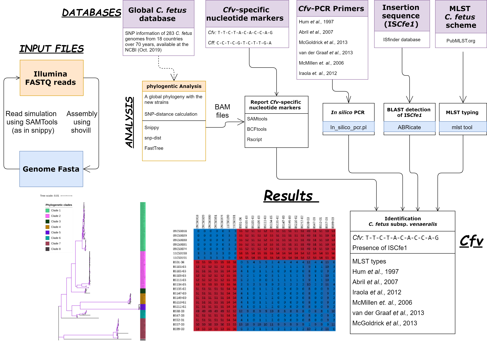

# cfvCatch: A workflow to identify the _Campylobacter fetus_ subsp. _venerealis_ (_Cfv_) strains

cfvCatch is a snakemake workflow for fast differentiation _Campylobacter fetus_ subsp. _venerealis_ (_Cfv_) strains from its neighbour _Campylobacter fetus_ subsp. _fetus_ (_Cff_) strains.  


##### This differentiation is done via reporting:

1. variant markers specific for the _Cfv_ phylogenetic group (defined below)
2. the presence of the IS*Cfe1* (_Cfv_ marker)
3. MLST types 
4. results of _in silico_ PCR assays

## _Cfv_ specific markers
Theses are specific nucleotide variants which, at a specific position, are identical in all genomes of the _Cfv_ clade and different from all genomes of all other clades, ignoring indels and variants located in the intergenic regions or within repeated sequences.

A list of these nucleotide variants are provided:

| Position in ref. genome | Target       | Protein id | Gene Length | Product                                                                       | Cfv (100) | Cff (182) | Effect on reference sequence | Cfv AA | Cff AA |
|-----------------------------------------|--------------|------------|-------------|-------------------------------------------------------------------------------|-----------|-----------|------------------------------|--------|--------|
| 39784                                   | CFF8240_0048 | ABK83415.1 | 396         | ribosomal protein S8                                                          | T         | C         | synonymous                   | L      | L      |
| 343646                                  | CFF8240_0373 | ABK82476.1 | 552         | conserved hypothetical protein                                                | T         | C         | synonymous                   | L      | L      |
| 399029                                  | CFF8240_0424 | ABK81969.1 | 708         | conserved hypothetical protein                                                | C         | T         | synonymous                   | G      | G      |
| 535915                                  | CFF8240_0528 | ABK83346.1 | 1131        | integral membrane protein-permease component, involved in lipoprotein release | T         | C         | synonymous                   | S      | S      |
| 654050                                  | CFF8240_0641 | ABK82108.1 | 507         | Hit family protein                                                            | A         | G         | non-synonymous               | I      | V      |
| 979346                                  | CFF8240_0977 | ABK82797.1 | 747         | NADP-dependent l-serine/l-allo-threonine dehydrogenase ydfg                   | C         | T         | non-synonymous               | C      | Y      |
| 1020607                                 | CFF8240_1016 | ABK82995.1 | 879         | phosphatase, Ppx/GppA family                                                  | A         | C         | non-synonymous               | D      | E      |
| 1025195                                 | CFF8240_1023 | ABK83085.1 | 615         | translocator protein, LysE family                                             | C         | T         | non-synonymous               | S      | N      |
| 1359201                                 | CFF8240_1380 | ABK83386.1 | 579         | general glycosylation pathway protein                                         | C         | T         | non-synonymous               | M      | I      |
| 1438083                                 | CFF8240_1456 | ABK82820.1 | 1032        | uroporphyrinogen decarboxylase                                                | A         | G         | synonymous                   | D      | D      |
| 1452736                                 | CFF8240_1473 | ABK83285.1 | 1791        | GTP-binding protein LepA                                                      | G         | A         | synonymous                   | T      | T      | 

The pipeline takes into account the phylogenetic position of the _C. fetus_ strains and the presence of the ISC*fe1* to determine the subspecies _Cfv_ i.e., the strain will be characterized as 
* _Cfv_ : if they 
    1. harbour the  insertion element IS*Cfe1* and 
    2. have the nucleotide variants specific for clade 1 (T-T-C-T-A-C-A-C-C-A-G)
* _Cff_ : if they 
    1. do not harbour the insertion element IS*Cfe1* and 
    2. have the nucleotide variants specific for clade 2-8 (C-C-T-C-G-T-C-T-T-G-A)

# Overview


# Authors

* Mostafa Abdel-Glil (@Mostafa.Abdel-Glil)
* Jörg Linde (@joerg.linde)


# Install cfvCatch

To install cfvCatch, you need to have [Miniconda](https://docs.conda.io/projects/conda/en/latest/user-guide/install/linux.html), [Snakemake Version 5.2.2 or newer](https://snakemake.readthedocs.io/en/stable/getting_started/installation.html) and [git](https://gist.github.com/derhuerst/1b15ff4652a867391f03) installed.
All ohter dependencies are downloaded during run-time.


#### Download cfvCatch:

    git clone https://gitlab.com/FLI_Bioinfo/Cfvcatch.git

#### Run cfvCatch

example: `bash ./cfvCatch -fq <path to fastq reads> -fa <path to fasta reads> --results_dir results --run true`

```
bash <path to cfvcatch>/cfvCatch -h

USAGE:
   bash ./cfvCatch -fq fastq_directory
REQUIRED:
   -fq, --fastq-directory DIR, a directory where the fastq reads are present (fastq reads can be also gzipped)
OPTIONAL:
   -fa, --fasta-directory DIR, a directory where the fasta reads are present
   -o, --outdir           DIR, a directory to write input data in correct format for snakemake (default: input/)
   --results_dir          DIR, a directory where the results will be written (default: results/)
                              Path should be relative to the snakemake directory - Donot use the full path
   --run [true, false]    Automatically run snakemake (default: true)
   --cores                Number of cores to use (default: available cpus)
   -h, --help

```

# References 
* snippy (https://github.com/tseemann/snippy) 
* mlst (https://github.com/tseemann/mlst)
* in silico PCR (https://github.com/egonozer/in_silico_pcr)
* ABRicate (https://github.com/tseemann/abricate)
* Shovill (https://github.com/tseemann/shovill)
* snp-dists (https://github.com/tseemann/snp-dists)
* FastTree (http://www.microbesonline.org/fasttree/)
